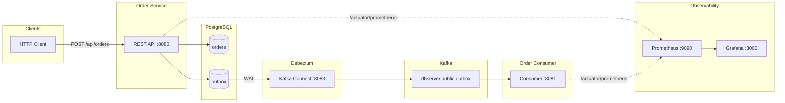

# Transactional Outbox + CDC

[](https://openjdk.org/)
[](https://spring.io/projects/spring-boot)
[](https://www.postgresql.org/)
[](https://kafka.apache.org/)
[](https://debezium.io/)
[](https://gradle.org/)
[](https://www.docker.com/)
[](https://prometheus.io/)
[](https://grafana.com/)
[](https://opensource.org/licenses/MIT)

A **production-style** demo of the **Transactional Outbox** pattern with **Change Data Capture (CDC)** on the JVM: orders are written to PostgreSQL in a single transaction with an outbox table; **Debezium** streams outbox changes to **Apache Kafka**; a consumer processes events without polling the database. Full observability with **Prometheus** and **Grafana**, and **one-command** run via Docker Compose.

---

## Features

| Feature | Description |
|--------|-------------|
| **Transactional Outbox** | Order and outbox row written in one DB transaction; at-least-once delivery without 2PC |
| **CDC with Debezium** | PostgreSQL WAL (pgoutput) → Debezium → Kafka; no application polling |
| **Event-driven consumer** | Spring Kafka listener parses Debezium envelope and processes `OrderCreated` events |
| **Contract-first events** | Shared `outbox-events` module (OrderCreated, Item); JSON payload in outbox |
| **Observability** | Actuator health & Prometheus metrics on both services; Grafana with pre-provisioned datasource |
| **Single-command run** | `docker compose up -d --build` runs Postgres, Kafka, Connect, both apps, Prometheus, and Grafana |
| **Tests** | Unit tests for OrderService (transaction + outbox) and OrderListener (Debezium parsing) |

---

## Architecture



**Flow:** Client creates an order via REST. **Order Service** persists the order and an outbox row in one transaction. **Debezium** (PostgreSQL source connector) reads the WAL and publishes outbox changes to Kafka. **Order Consumer** subscribes to the topic, extracts the event payload from the Debezium envelope, and processes it (e.g. logging or downstream logic).

---

## Tech Stack

| Layer | Technology |
|-------|------------|
| **Language** | Java 21 |
| **Framework** | Spring Boot 3.2 (Web, Data JPA, Kafka, Actuator) |
| **Build** | Gradle 8.5 (Kotlin DSL), multi-module |
| **Database** | PostgreSQL 16, Flyway migrations |
| **CDC** | Debezium 2.4 (PostgreSQL connector, pgoutput) |
| **Messaging** | Apache Kafka 3.7 (KRaft) |
| **Observability** | Micrometer, Prometheus, Grafana |
| **Runtime** | Docker, Docker Compose |

---

## Quick Start

### Prerequisites

- **Docker** and **Docker Compose**

### Run the full stack

```bash
git clone https://github.com/NullPoint3rDev/transactional-outbox-cdc.git
cd transactional-outbox-cdc
docker compose up -d --build
```

Wait 1–2 minutes for all services to start. The **register-connector** container will register the Debezium connector (with retries). If the connector is not listed, register it manually:

```bash
curl -s -X POST -H "Content-Type: application/json" \
  -d @deploy/outbox-connector.json \
  http://localhost:8083/connectors
```

### Create an order and verify the pipeline

```bash
# Create order
curl -s -X POST http://localhost:8080/api/orders \
  -H "Content-Type: application/json" \
  -d '{"customerId":"alice","totalPrice":99.99,"items":[{"itemId":"SKU-1","itemsAmount":2,"itemsPrice":49.99}]}' | jq

# Check consumer logs (should show "Order created: orderId=..., customerId=alice")
docker compose logs order-consumer --tail 15
```

---

## Services & Ports

| Service | Port | Description |
|---------|------|-------------|
| **Order Service** | 8080 | REST API, health, Prometheus |
| **Order Consumer** | 8081 | Kafka consumer, health, Prometheus |
| **Kafka Connect** | 8083 | Debezium REST API |
| **Prometheus** | 9090 | Metrics |
| **Grafana** | 3000 | Dashboards (admin / admin) |
| **PostgreSQL** | 5432 | Database |
| **Kafka** | 9092 | Broker |

---

## API

### Create order

**`POST /api/orders`**

| Field | Type | Description |
|-------|------|-------------|
| `customerId` | string | Customer identifier |
| `totalPrice` | number | Order total |
| `items` | array | Optional list of `{ itemId, itemsAmount, itemsPrice }` |

**Example:**

```bash
curl -X POST http://localhost:8080/api/orders \
  -H "Content-Type: application/json" \
  -d '{"customerId":"bob","totalPrice":50.00,"items":[]}'
```

**Response (201):** Order object with `orderId`, `customerId`, `totalPrice`, `createdAt`.

### Health & metrics

- **Order Service:** `GET http://localhost:8080/actuator/health`, `GET http://localhost:8080/actuator/prometheus`
- **Order Consumer:** `GET http://localhost:8081/actuator/health`, `GET http://localhost:8081/actuator/prometheus`

---

## Project Structure

```
transactional-outbox-cdc/
├── outbox-events/          # Shared event DTOs (OrderCreated, Item), constants
├── order-service/          # REST API, JPA, Flyway, writes orders + outbox in one transaction
├── order-consumer/         # Kafka listener, parses Debezium envelope, processes OrderCreated
├── deploy/
│   ├── outbox-connector.json   # Debezium PostgreSQL connector config
│   └── register-connector.sh  # Optional: register connector from host
├── grafana/                # Datasource provisioning (Prometheus)
├── docker-compose.yml      # Full stack
├── prometheus.yml          # Scrape config for order-service & order-consumer
├── Dockerfile.order-service
├── Dockerfile.order-consumer
├── LICENSE
└── README.md
```

---

## Configuration

Default credentials (for local/demo only; override in production):

- **PostgreSQL:** `postgres` / `postgres`, database `outbox_db`
- **Grafana:** `admin` / `admin`

Override via environment variables (e.g. in Docker Compose or `.env`): `SPRING_DATASOURCE_URL`, `SPRING_DATASOURCE_PASSWORD`, `GF_SECURITY_ADMIN_PASSWORD`, etc.

---

## Running tests

```bash
./gradlew test
```

- **order-service:** `OrderServiceTest` — verifies order and outbox are saved in one transaction.
- **order-consumer:** `OrderListenerTest` — verifies Debezium envelope parsing and `processOrderCreated` invocation; skips when `after` or payload is null/blank.

---

## License

This project is licensed under the [MIT License](LICENSE).
